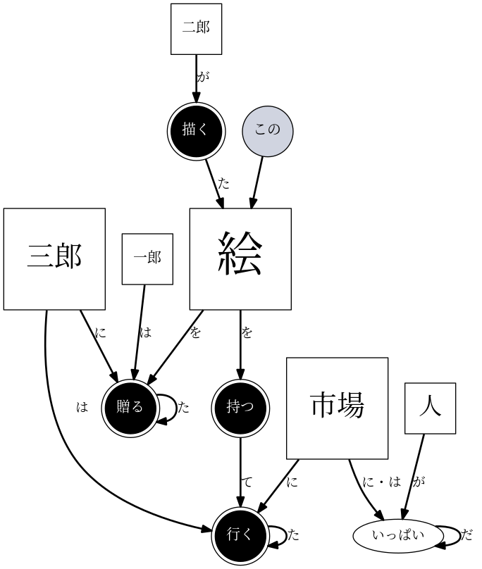
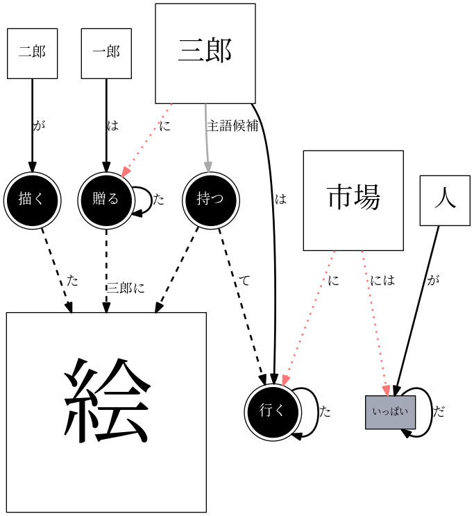

# Naruhodo(なるほど)

[](https://travis-ci.org/superkerokero/naruhodo)
[](https://opensource.org/licenses/MIT)
[](https://badge.fury.io/py/naruhodo)

[日本語はこちら](README-ja.md)

`naruhodo` is a python library for generating dependency structure graph(DSG) and knowledge structure graph(KSG) from English/Japanese text or urls that contain English/Japanese texts. You can visualize these graphs directly in jupyter notebook or export graphs to JSON file for visualization using external programs.

### Dependency structure graph (DSG)

[Dependency parsing](https://web.stanford.edu/~jurafsky/slp3/14.pdf) is the analysis of [dependency grammar](https://en.wikipedia.org/wiki/Dependency_grammar) on a block of text using computer programs. 
The directed linking nature of dependency grammar makes the result of dependency parsing directed graphs. I call this graph dependency structure graph(DSG). This dependency information, combined with the information of word types, transformations, and other contextual information like word embeddings are the bread and butter of the text comprehension by computers.

It should be noted that DSG is not immediately useful to humans or computers(except for getting some rough ideas about the keywords and complexity of your input text), but it is important information and can be used to generate knowledge structure graph(KSG) that will be introduced later. 

`naruhodo` generates denpendency structure graphs(DSG) directly from the output of dependency parsing programs. 

Below is an example of DSG generated by naruhodo using the following texts.

```
"一郎は二郎が描いた絵を三郎に贈った。"
"三郎はこの絵を持って市場に行った。"
"市場には人がいっぱいだ。"
```



### Knowledge structure graph(KSG)

Unlike DSG, knowledge structure graph(KSG) tries to capture meaningful relationships between different entities. You can think of it as a generic knowledge base represented using a directed graph. KSG is generated using the output of dependency parsing program with other information like word types and transformations.

In KSG, there are primarily two kinds of nodes:
* nodes that represent entities (mostly nouns or words that can be used as nouns)
* nodes that represent properties or actions (mostly adjectives and verbs)

Entity nodes are interconnected by property/action nodes. Edges represent the relationship between nodes. If an entity has a property or performs an action, it has an edge pointing to corresponding property/action nodes. If an entity is part of the property of another entity or the object of an action, it has an edge pointing to it(from the entity or action).

I think this kind of graph structure is very close to how information/knowledge is stored in human brains. The goal of `naruhodo`'s KSG parsing is to generate this kind of graph structure from human readable texts as accurate and complete as possible automatically.

The methods available to KSG is almost identical to those of DSG.

Below is an example of KSG generated by `naruhodo` using the following texts.

```
"一郎は二郎が描いた絵を三郎に贈った。"
"三郎はこの絵を持って市場に行った。"
"市場には人がいっぱいだ。"
```



## Installation

`naruhodo` supports `python` version 3.4 and above.
You can install the library directly using pip:

```bash
pip install naruhodo
```

This will install the latest release version of `naruhodo`. 
The current development version of `naruhodo` can be installed from github repository directly using the following command:

```bash
pip install https://github.com/superkerokero/naruhodo/archive/dev.zip
``` 

`naruhodo` relies on external programs to do Japanese word and dependency parsing, so you need to have corresponding programs installed as well.

`naruhodo` is designed to support multiple backend parsers, but currently only the support for `mecab` + `cabocha` is implemented.

For guide on installing `mecab` and `cabocha`, please refer to this page:

[Amazon Linux に MeCab と CaboCha をインストール](https://qiita.com/january108/items/85c80769ea870c190eaa)

Support for other parsers such as `KNP` is planned in the future.

## Tutorial

The tutorial of `naruhodo` is provided as a `ipynb` file in the tutorial folder. You can view it directly in your browser. This tutorial covers all the main functionalities of naruhodo.

[Tutorial notebook](https://github.com/superkerokero/naruhodo/blob/master/tutorial/Tutorial.ipynb)

## Python-API

The complete python API document for `naruhodo` can be found here:

[`naruhodo` Python API Reference](https://superkerokero.github.io/naruhodo).

This document is generated automatically from source code using [pdoc](https://github.com/BurntSushi/pdoc), so it is up-to-date at any time.

## Change-Log

* 0.2.0
  * Major API change for multi-language support and parallel processing. 
  * Parallel processing support for parsing using multiprocess module. 
* 0.1.0
  * Initial version

## Development status and some personal comments

`naruhodo` is still in development state(especially KSG related part), so you might find it outputs weird results sometimes. If you like the idea and want to help improve the library, feel free to create a pull request on github.

Here are some of my thoughts on the development of `naruhodo` :

* ### Improvement on the quality of generated graph (0.2 ~ 0.5)
    
    As you can see from the source code, `naruhodo` relies mostly on rule-based system to parse given information.
    And for a subject as large and complex as a language, long-term testing and procedural improvement of the program is neccessary before it can go anywhere.

    Currently the knowledge structure graph(KSG) generated by `naruhodo` is below my expectation for large amount of input texts. Improvement will come from furthur examination on varieties of input text and corresponding refinement of parsing logic.

    As a rule-based system, it certainly has its limitations such as completely resolving coreferences. But I believe in the realm of NLP, especially in rudimentary information parsing tasks, rule-based system can be used to make practical applications. Recent advances in statitics-based techniques such as deep learning seem promising. But almost all of these techniques require large amount of labelled data, which is hard to retrieve. The rule-based approach taken here is more or less an Ab Initio way of looking at some NLP problems(which doesn't take any training data before making useful predictions). My hope is that applications like this may at least alleviate the pain of collecting large amount of labelled data by automating some of the tedious tasks. `naruhodo` is my personal experiment on how far rule-based system can go in the world of NLP. It may fail to be practically useful, but I am sure it is going to be an interesting journey. 

* ### Support for more backends (0.5 ~)
    
    There aren't many Japanese parsing programs available on the internet yet. Aside of `mecab` + `cabocha`, the most usable parsing program seems to be `juman(++)` + `knp`. The output format of `knp` does contain extra useful information and can be more accurate than `cabocha` in some situations. But its output lacks a unified scheme, making it difficult to use. Another important fact is that `juman(++)` + `knp` parsing can be very time consuming compared to `mecab` + `cabocha`, which limits its use cases.

    I am looking into some fast generic libraries like `spaCy` as well. Though Japanese is not the officially supported language for the moment. 

    To summarize, though `naruhodo` is designed to support multiple backends, since its current focus is Japanese only, adding support for other backends is not a priority.

* ### Support for other languages(?~)
    
    Japanese is the only language `naruhodo` supports now. Besides my personal interest, I chosen Japanese because it has some unique characteristics that make it both challenging and rewarding. In my opnion, the difficulty regarding Japanese mostly comes from its ambiguity in the expression(for example, the subject is frequently ommited in Japanese) and large amount of word transformations(the same verb can have as many as 10+ forms).

    From a practical point of view, languages such as English and Chinese are in potentially large demand. So I am thinking about expanding the library to these popular languages in the future, if the rule-based approach taken by `naruhodo` proves to be usable afterall.

* ### Adding statistics-based approaches(?~)
    
    It seems that everybody is excited about machine learning these days. And I do see huge application potential in techniques like reinforcement learning and generative adversarial models. I do have some thoughts about the applications of these techniques to some specific knowledge retrieval problems. For example, the coreference problem is obviously outside the reach of any rule-based systems, and a reinforcement learning based approach seems quite attractive in this case(provided that we have a real-time feedback system from users).
    
    As my understanding of machine learning techniques improves, some statistics-based approaches may be added in the future.

* ### Adding coreference resolution capability (0.5 ~)

    [Coreference resolution](https://en.wikipedia.org/wiki/Coreference) is the task of finding all expressions that refer to the same entity in a text. Without proper coreference resolution, generated KSG does not capture all meaningful information, and its usability will be quite limited. Currently `naruhodo` has no coreference resolution implemented, which is one of the most important reasons I say it is "below my expectation".
    I am experimenting with some published works on this topic. A method based on word embeddings might be added to `naruhodo` first starting from version 0.5 ~.

* ### Applications based on DSG and KSG(new projects)
    
    I think information of DSG and KSG is especially useful in the realm of automating information retrieval processes. This includes, but not limited to, 
    * automatic text summarization
    * knowledge base generation for Q&A system and translation system 
    * generic sentiment analysis

    As the quality of KSG generated by `naruhodo` improves, I will try to apply it to some of these areas.

